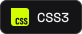
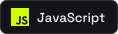
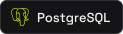

### José Luiz · Full Stack & TI

Sites, apps, sistemas e automação.

**[Portfólio ↗](https://joseluiz.dev.br/)** &nbsp;·&nbsp; [LinkedIn](https://www.linkedin.com/in/jos%C3%A9-luiz-115861362) &nbsp;·&nbsp; [E-mail](mailto:josehtl07@gmail.com)

---

### Sobre

Sou desenvolvedor full stack e responsável pelo TI de uma empresa. Estudo Análise e Desenvolvimento de Sistemas na UniFAAT, no segundo ano.

Também construo fora do trabalho: loja com pagamento, app de finanças, página de casal e assistente de voz. Em cada um faço a interface, o banco e o deploy, e entrego no ar.

Quando uma rotina é repetitiva demais para ocupar uma pessoa, eu escrevo um robô.

### Tecnologias e ferramentas

**Front-end**

  
  
  
  
  
  
  
  

**Back-end e dados**

  
  
  
  
  
  

**Automação e infraestrutura**

  
  
  
  
  
  
  
  
  

**Ferramentas**

  
  
  
  
  
  

### Projetos

- [London Fog ↗](https://londonfogoficial.com.br/)
- [Ápice Contabilidade ↗](https://apicecontabilidade.cnt.br/)
- [Otto ↗](https://otto-one-snowy.vercel.app/)
- [AttentionGuard ↗](https://github.com/zzin742/AttentionGuard)
- [Bots em Python ↗](https://github.com/zzin742/meus-bots)

[Todos os projetos no portfólio →](https://joseluiz.dev.br/#projetos)
