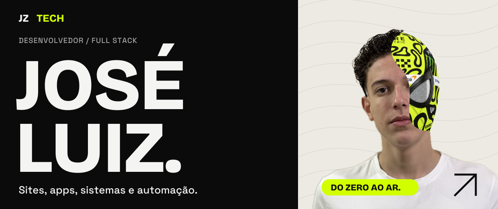
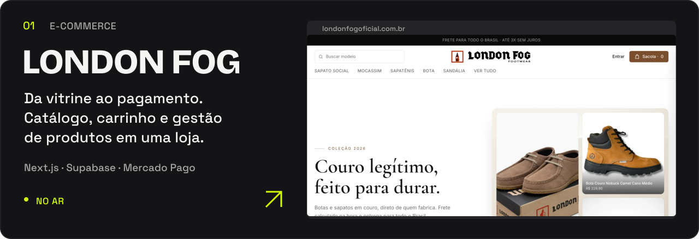
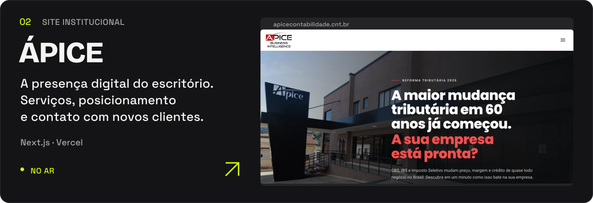
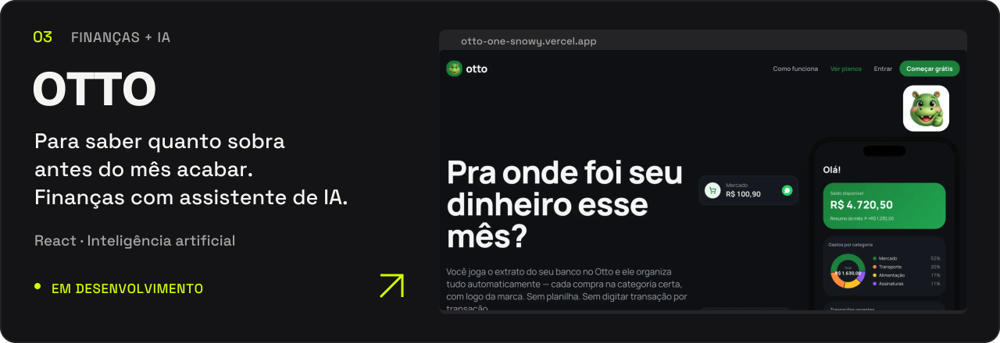
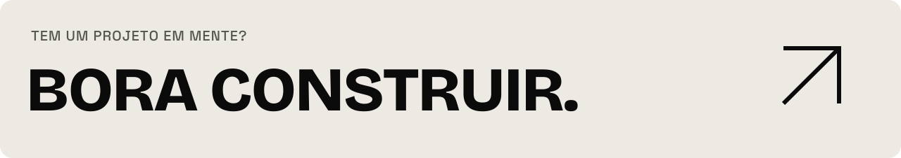

<a href="https://joseluiz.dev.br/">
  <picture>
    <source media="(max-width: 640px)" srcset="./assets/hero-mobile.svg" />
    
  </picture>
</a>

  <a href="https://joseluiz.dev.br/"><strong>PORTFÓLIO ↗</strong></a> &nbsp;&nbsp; / &nbsp;&nbsp;
  <a href="https://www.linkedin.com/in/jos%C3%A9-luiz-115861362">LinkedIn</a> &nbsp;&nbsp; / &nbsp;&nbsp;
  <a href="mailto:josehtl07@gmail.com">E-mail</a>

Faço a interface, conecto os dados e coloco no ar. Sou **José Luiz**, desenvolvedor full stack e responsável pelo TI de uma empresa. Moro em Piracaia, SP, e estudo ADS na UniFAAT.

## Projetos que você pode abrir

<a href="https://londonfogoficial.com.br/">
  <picture>
    <source media="(max-width: 640px)" srcset="./assets/london-fog-mobile.svg" />
    
  </picture>
</a>

<a href="https://apicecontabilidade.cnt.br/">
  <picture>
    <source media="(max-width: 640px)" srcset="./assets/apice-mobile.svg" />
    
  </picture>
</a>

<a href="https://otto-one-snowy.vercel.app/">
  <picture>
    <source media="(max-width: 640px)" srcset="./assets/otto-mobile.svg" />
    
  </picture>
</a>

**[Ver todos os projetos no portfólio →](https://joseluiz.dev.br/#projetos)**

## Sistemas que a empresa abre toda manhã

No **Ápice Hub**, reuni chat, tarefas, BI, documentos, treinamento e chamados em uma plataforma que substituiu **cinco ferramentas**. Sou o desenvolvedor principal do sistema e também cuido de redes, máquinas e acessos para **mais de 80 pessoas**.

Quando uma rotina é repetitiva demais para ocupar uma pessoa, escrevo uma automação.

### Para explorar o código

- **[AttentionGuard ↗](https://github.com/zzin742/AttentionGuard)** — visão computacional com Python, OpenCV e MediaPipe para estudar sinais de distração e sonolência.
- **[Bots em Python ↗](https://github.com/zzin742/meus-bots)** — automações de tarefas, com exemplos adaptados para preservar os processos internos.

### Minha base de trabalho

`TypeScript` `React` `Next.js` `Node.js` `Supabase` `PostgreSQL` `Python` `Playwright`

Do desenvolvimento à operação: interface, banco de dados, integrações, deploy e TI.

 

José Luiz · Piracaia, SP · <a href="https://joseluiz.dev.br/">joseluiz.dev.br</a>

