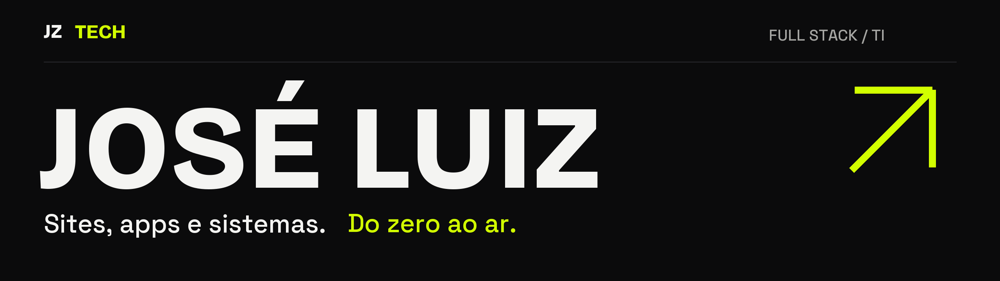

  <a href="https://joseluiz.dev.br/"><strong>Portfólio ↗</strong></a> &nbsp;·&nbsp;
  <a href="https://www.linkedin.com/in/jos%C3%A9-luiz-115861362">LinkedIn</a> &nbsp;·&nbsp;
  <a href="mailto:josehtl07@gmail.com">E-mail</a>

Sou **José Luiz**, desenvolvedor full stack em Piracaia, SP. Construo sites, lojas, apps e sistemas — da interface ao banco de dados e ao deploy. Também sou responsável pelo TI de uma empresa e estudo Análise e Desenvolvimento de Sistemas na UniFAAT.

### Projetos selecionados

**[London Fog ↗](https://londonfogoficial.com.br/)**  
Loja de calçados com catálogo, carrinho, pagamento e painel para cadastrar produtos.  
Next.js · Supabase · Mercado Pago

**[Ápice Contabilidade ↗](https://apicecontabilidade.cnt.br/)**  
Site institucional com os serviços do escritório e contato direto para novos clientes.  
Next.js · Vercel

**[Otto ↗](https://otto-one-snowy.vercel.app/)**  
App de finanças pessoais com assistente de IA para entender quanto sobra no fim do mês.  
React · IA · Em desenvolvimento

[Mais projetos no portfólio →](https://joseluiz.dev.br/#projetos)

### O que construo no trabalho

Sou o desenvolvedor principal do **Ápice Hub**, uma plataforma interna que reúne chat, tarefas, BI, documentos, treinamento e chamados. Ela substituiu **cinco ferramentas** usadas pela empresa.

Também cuido de redes, máquinas e acessos para **mais de 80 pessoas**, além de criar automações que tiram tarefas repetitivas da rotina.

### Código por aqui

- **[AttentionGuard](https://github.com/zzin742/AttentionGuard)** — estudo de visão computacional com Python, OpenCV e MediaPipe para detectar sinais de distração e sonolência.
- **[Bots em Python](https://github.com/zzin742/meus-bots)** — exemplos de automação de tarefas, adaptados para preservar os processos internos.

### Ferramentas do dia a dia

**Web:** TypeScript, React, Next.js e Tailwind.  
**Dados e backend:** Node.js, Supabase e PostgreSQL.  
**Automação e operação:** Python, Playwright, Git, Vercel, redes e servidores.

---

Tem um projeto em mente? **[Bora conversar →](mailto:josehtl07@gmail.com)**
