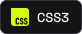
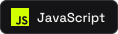
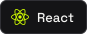
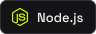
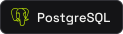
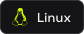
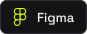

<!--
  Perfil em estilo terminal. Tudo que se mexe é SVG animado (o GitHub não roda JS nem CSS
  do README, mas renderiza SVG via  e executa as animações SMIL/CSS de dentro dele).

  contrib-heatmap.svg  -> dados reais, regenerado todo dia por .github/workflows/update-profile-art.yml
  jose-ascii.svg       -> retrato ASCII (estático): python scripts/prep_photo.py && python scripts/make_ascii_svg.py
  info-card.svg        -> card neofetch (estático):  python scripts/make_info_card.py
  Retrato atual: perfil olhando pra esquerda (NO_REMBG=1 HEAD_FRAC=0.68 LINES=0.5 FADE=0.15 CLAHE=2.5 no prep;
  COLS=220 DITHER=1 no ascii). Alternativas prontas em assets/portrait/ (espelhado e frontal).
-->

  

<h3><code>jose@jztech ~ $ ./contributions.sh</code></h3>

  

<h3><code>jose@jztech ~ $ whoami</code></h3>

  
  

 

<h3><code>jose@jztech ~ $ cat sobre.txt</code></h3>

Sou desenvolvedor full stack e responsável pelo TI de uma empresa. Estudo Análise e Desenvolvimento de Sistemas na UniFAAT, no segundo ano.

Também construo fora do trabalho: loja com pagamento, app de finanças, página de casal e assistente de voz. Em cada um faço a interface, o banco e o deploy, e entrego no ar.

Quando uma rotina é repetitiva demais para ocupar uma pessoa, eu escrevo um robô.

 

<h3><code>jose@jztech ~ $ cat stack.txt</code></h3>

**Front-end**

  
  
  
  
  
  
  
  

**Back-end e dados**

  
  
  
  
  
  

**Automação e infraestrutura**

  
  
  
  
  
  
  
  
  

**Ferramentas**

  
  
  
  
  
  

 

<h3><code>jose@jztech ~ $ ls ~/projetos</code></h3>

  <a href="https://londonfogoficial.com.br/">London Fog ↗</a> &nbsp;·&nbsp;
  <a href="https://apicecontabilidade.cnt.br/">Ápice Contabilidade ↗</a> &nbsp;·&nbsp;
  <a href="https://otto-one-snowy.vercel.app/">Otto ↗</a> &nbsp;·&nbsp;
  <a href="https://github.com/zzin742/AttentionGuard">AttentionGuard ↗</a> &nbsp;·&nbsp;
  <a href="https://github.com/zzin742/meus-bots">Bots em Python ↗</a>

[Todos os projetos no portfólio →](https://joseluiz.dev.br/#projetos)

 

<h3><code>jose@jztech ~ $ ./links.sh</code></h3>

 

